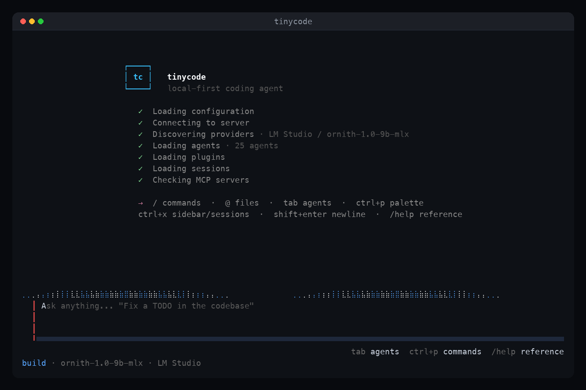

# tinycode

Local-first AI coding assistant. Bring any model — single binary, no runtime dependencies.



[](https://github.com/bobbyjohnstx/tinycode/actions/workflows/go-ci.yml) [](LICENSE)

Local-first, model-agnostic AI coding assistant. A single Go binary embeds the HTTP server, terminal UI, session management, LLM client, and tool execution --- no Node.js, no separate server process. Works with any OpenAI-compatible endpoint (Ollama, vLLM, LM Studio, OpenRouter, and more). Your sessions stay in local SQLite; data leaves your machine only when you send a prompt to a provider you configured.

## Quick start

### Install

```bash
# One-liner (macOS / Linux) — installs to ~/.local/bin
curl -fsSL https://raw.githubusercontent.com/bobbyjohnstx/tinycode/main/install.sh | sh

# Or Homebrew
brew install bobbyjohnstx/tap/tinycode
```

See [docs/install.md](docs/install.md) for platform notes, PATH setup, and verifying the install.

### First prompt

Have a local model running (for example `ollama serve` and `ollama pull qwen3.5:9b`), then:

```bash
tinycode doctor                   # diagnose config/providers (not a setup wizard)
tinycode                          # TUI in the current directory
tinycode /path/to/project         # TUI against a project
```

If no model was auto-discovered, type `/connect` in the TUI to pick a provider and model. There is no separate `tinycode setup` command — doctor + `/connect` is the first-run path.

Type a prompt and press Enter:

```
Explain what this repository does in 2 sentences.
```

Press `Ctrl+X` then `m` to pick a model if needed. Full walkthrough: [docs/getting-started.md](docs/getting-started.md).

### Build from source

```bash
git clone https://github.com/bobbyjohnstx/tinycode.git && cd tinycode
make build
./dist/tinycode
```

Requires Go 1.27.1+. Other modes: `tinycode web` (browser UI), `tinycode serve` (headless API), `tinycode acp` (IDE), `tinycode run` (non-interactive).

## What it is

### Key features

- **Multi-agent orchestration** --- build agent delegates to executor, architect, and critic subagents; `/swarm` dispatches parallel subagents as goroutines (not the legacy TypeScript tmux swarm — see [docs/spec/16-not-implemented.md](docs/spec/16-not-implemented.md)); `--plan` flag shows decomposition for review before dispatch
- **14 built-in agents** --- architect, debugger, executor, code-reviewer, and more (Tab to cycle, `/ask` for one-shot); `plan` is a native mode (`plan_enter`/`plan_exit`) for read-only research and planning
- **10 bundled skills** --- debug, verify, trace, review, plan, test, doctor, mcp-setup, remember, deepinit
- **Workflow commands** --- `/effort` adjusts reasoning depth per session, `/goal` runs autonomous multi-turn loops until a condition is met, `/branch` forks conversations to try alternatives
- **Context management** --- `/context` visualizes context window usage with per-category breakdown, `/btw` asks side questions without polluting history, `/changes` shows only files tinycode modified (not all uncommitted changes); automatic elision at 80% context, LLM summarization at the limit, `/compact` for manual compaction
- **Built-in tools** --- `monitor` watches background processes with buffered event delivery, `notepad` provides session-scoped scratch storage that survives compaction, `report_findings` outputs structured code review results, `notify` sends desktop notifications with urgency levels
- **Hooks** --- shell hooks in `settings.json` for lightweight lifecycle automation without writing a plugin; `additionalContext` lets hooks inject text into the model's context
- **Frecency ranking** --- command palette ranked by usage frequency + recency
- **MCP integration** --- connect external tool servers via stdio, SSE, or streamable HTTP; manage with `/mcp` dialog
- **Multimodal input** --- paste images from clipboard (`/paste-image`) for vision-capable models
- **Extended thinking** --- `/thinking` controls reasoning budget (off/low/medium/high/max)
- **Model scoping** --- `/scoped-models` favorites list to filter the model selector
- **Snapshot undo/redo** --- `/undo` and `/redo` revert or restore AI file changes; `/rewind` rolls back to any earlier conversation turn
- **Diff viewer** --- `/diff` shows uncommitted changes inline
- **Clipboard copy** --- `/copy` copies responses to clipboard with code-block picker
- **apply_patch tool** --- atomic multi-file edits via unified diff
- **@ file references** --- autocomplete with directory drill-down
- **Session auto-titling** --- titles generated from the first prompt
- **In-transcript search** --- Ctrl+F to search the chat, Ctrl+N/Ctrl+P to navigate matches
- **Session archive** --- `/archive` soft-deletes sessions (recoverable)
- **HTML export** --- `/export html` for self-contained HTML with syntax highlighting
- **Which-key panel** --- press Ctrl+X to see all leader key follow-ups in a floating overlay
- **Terminal bell and desktop notifications** --- audible bell on task completion; `notify` tool for desktop alerts with WSL support
- **Leader key system** --- Ctrl+X prefix for sidebar, sessions, editor, diff, themes, MCP, and more
- **Session resume from CLI** --- `-c` continues the most recent session; `-r` resumes by ID or title
- **tinycode doctor** --- headless diagnostics that verify config, database, providers, agents, and plugins
- **Safe mode** --- `--safe-mode` skips plugins, MCP, and user agents; status bar shows bold indicator
- **System prompt override** --- `--append-system-prompt` and `--append-system-prompt-file` inject custom instructions
- **Token budget ceiling** --- `--max-tokens` sets a cumulative token limit; session aborts when exceeded
- **External editor** --- `/editor` opens `$EDITOR`; `/editor @file` edits a file directly
- **Interactive shell** --- `/shell` drops into a shell session

### Interfaces

The primary interface is the **terminal UI (TUI)** --- a full-featured interactive session with conversation history, model switching, agent/skill invocation, and inline tool approval. The TUI starts instantly and keeps you in the same environment as your code.

tinycode also supports:

- **Web UI** (`tinycode web`) --- serves the embedded SolidJS SPA plus API and opens a browser with an auth URL. This is the supported GUI path for the Go product. In-browser PTY and session share/publish are not available (`config.share` defaults to `"disabled"`).
- **Headless API server** (`tinycode serve`) --- REST + SSE endpoints only (no SPA); for programmatic access
- **Agent Client Protocol** (`tinycode acp`) --- real stdio ACP transport for IDE integration (`internal/acp/service.go`, …; VS Code, Zed, JetBrains)
- **Non-interactive mode** (`tinycode run`) --- run a prompt and exit, for scripts and CI

The Electron shell in `packages/desktop` is experimental and unsupported for the Go product. A Go-native desktop app is not planned.

## Architecture

Standard Go layout: `cmd/` for binaries, `internal/` for private packages, `pkg/` for public SDK.

### `cmd/tinycode/` --- Main binary

Single entry point. Subcommands: `tui` (default), `serve`, `web`, `acp`, `run`, `models`, `providers`, `session`, `status`, `export`, `plugin`, `init`, `agent`, `doctor`, `debug`, `version`.

### `internal/` --- Core packages

| Package        | Description                                                                    |
| -------------- | ------------------------------------------------------------------------------ |
| `tui/`         | Terminal UI ([bubbletea](https://github.com/charmbracelet/bubbletea), Elm architecture) |
| `tui/api/`     | HTTP client for the embedded server API                                        |
| `server/`      | HTTP server (standard library `net/http`), REST + SSE endpoints                |
| `session/`     | Session lifecycle, processor loop, LLM coordination                            |
| `llm/`         | LLM client abstraction, OpenAI-compatible streaming, tool-call JSON repair     |
| `provider/`    | Provider auto-discovery (Ollama, vLLM, LM Studio, OpenRouter)                  |
| `agent/`       | Agent definitions and prompt files                                             |
| `tool/`        | Tool implementations (file ops, shell, grep, glob)                             |
| `config/`      | Config file parsing (`tinycode.jsonc` → `tinycode.json` → `config.json`)       |
| `storage/`     | SQLite via modernc.org/sqlite, migrations                                      |
| `bus/`         | Event bus for inter-component communication                                    |
| `mcp/`         | Model Context Protocol client                                                  |
| `acp/`         | Agent Client Protocol (stdio transport for IDE integration)                    |
| `plugin/`      | Plugin lifecycle management                                                    |
| `permission/`  | Tool permission prompting and rules                                            |
| `skill/`       | Skill discovery and loading                                                    |
| `vcs/`         | Git operations                                                                 |
| `command/`     | Slash command discovery (built-in commands, agents, skills)                     |
| `project/`     | Project metadata, VCS detection, worktree paths                                |
| `frontmatter/` | YAML-like frontmatter parser for agent and skill markdown files                |
| `id/`          | Sortable ID generation with typed prefixes                                     |
| `redhat/`      | Red Hat shared library (OcClient, APIClient, PromQL, Containerfile parser)     |
| `static/`      | Embedded web app file server with SPA fallback                                 |
| `earlyinit/`   | Package-init side effects that run before other imports                        |

### `pkg/plugin/` --- Public Go plugin SDK

Protocol definitions, hook interfaces, and tool registration for building plugins.

## Plugins

30 built-in plugins, each a standalone Go binary communicating over JSON-RPC via stdin/stdout.

| Plugin               | Description                                                             |
| -------------------- | ----------------------------------------------------------------------- |
| `plugin-log-sanitizer` | Redacts secrets and sensitive data from tool output                   |
| `plugin-pilot`       | Issue tracker integration (list, create, update, comment)               |
| `plugin-safety-net`  | Blocks dangerous shell commands before execution                        |
| `plugin-telemetry`   | Tool call tracking and usage reporting                                  |

#### Red Hat --- OpenShift

| Plugin                         | Description                                                         |
| ------------------------------ | ------------------------------------------------------------------- |
| `plugin-ocp-context-injection` | Injects current OpenShift cluster/project context into sessions     |
| `plugin-ocp-obs-logging`       | OpenShift observability: log queries via Loki/LokiStack             |
| `plugin-ocp-obs-metrics`       | OpenShift observability: PromQL queries and alert inspection        |
| `plugin-ocp-must-gather`       | Must-gather directory management and structure validation           |
| `plugin-ocp-odf`               | OpenShift Data Foundation StorageCluster status                     |
| `plugin-ocp-virt`              | OpenShift Virtualization VM listing and management                  |
| `plugin-audit-logs`            | Must-gather audit log aggregation and analysis                      |
| `plugin-etcd-diag`             | Must-gather etcd diagnostics (slow writes, fsyncs, compaction)      |
| `plugin-ingress-inspect`       | Must-gather IngressController inspection                            |
| `plugin-insights`              | Red Hat Insights archive extraction and validation                  |

#### Red Hat --- Ansible

| Plugin                   | Description                                                             |
| ------------------------ | ----------------------------------------------------------------------- |
| `plugin-aap-bridge`     | Ansible Automation Platform bridge (health, job templates, inventories)  |

#### Red Hat --- RHOAI

| Plugin                          | Description                                                       |
| ------------------------------- | ----------------------------------------------------------------- |
| `plugin-rhoai-mlflow`          | MLflow experiment and run management                               |
| `plugin-rhoai-pipelines`       | RHOAI/Kubeflow pipeline management (create, run, monitor)          |
| `plugin-rhoai-serving`         | RHOAI model serving (inference services)                           |

#### Red Hat --- Platform

| Plugin                          | Description                                                       |
| ------------------------------- | ----------------------------------------------------------------- |
| `plugin-satellite`              | Satellite administration (hosts, errata, content views, health)   |
| `plugin-quay`                   | Quay container registry (search, tags, security scans)            |
| `plugin-rhdh`                   | Red Hat Developer Hub catalog and template operations              |
| `plugin-tekton`                 | Tekton pipeline and task management                                |
| `plugin-rhacm`                  | Red Hat Advanced Cluster Management (clusters, policies)          |
| `plugin-rhacs`                  | Red Hat Advanced Cluster Security (image scanning, health)        |
| `plugin-rh-api-catalog`        | Red Hat API catalog discovery and documentation                    |
| `plugin-rh-dev-content`        | Red Hat developer content and learning resources                   |
| `plugin-rh-ecosystem-catalog`  | Red Hat Ecosystem Catalog (certified images, operators)            |
| `plugin-rhdp-provisioner`      | Red Hat Demo Platform environment provisioning                     |
| `plugin-container-linter`      | Containerfile/Dockerfile linting and bootc validation              |
| `plugin-lightwell`             | Lightwell integration for Red Hat product lifecycle data           |

Plugins use the SDK in `pkg/plugin/`. See [docs/plugin-development.md](docs/plugin-development.md) for building custom plugins.

## Agents

Press **Tab** to cycle through agents, or use `<leader>a` to pick from a list. Use `/ask <agent> <prompt>` to invoke any agent as a one-shot subagent.

### Built-in agents

| Agent               | Description                                                                   |
| ------------------- | ----------------------------------------------------------------------------- |
| `architect`         | Strategic architecture advisor --- analyzes code, diagnoses bugs (read-only)  |
| `code-reviewer`     | Severity-rated code review with logic defect detection and SOLID checks       |
| `code-simplifier`   | Simplifies recently modified code without changing behavior                   |
| `critic`            | Multi-perspective review of plans and code with gap analysis (read-only)      |
| `debugger`          | Root-cause analysis, regression isolation, stack trace analysis                |
| `executor`          | Focused task executor --- smallest viable diff, no scope creep                |
| `explore`           | Fast read-only codebase search (grep/glob)                                    |
| `git-master`        | Git expert for atomic commits, rebasing, and history management               |
| `qa-tester`         | Interactive CLI testing specialist using tmux for session management           |
| `scientist`         | Data analysis and research --- hypothesis-driven, evidence required           |
| `security-reviewer` | Security vulnerability detection (OWASP Top 10, secrets, CVEs)               |
| `test-engineer`     | Test strategy, coverage authoring, flaky test hardening, TDD workflows        |
| `verifier`          | Evidence-based verification of completion claims                              |
| `writer`            | Technical documentation                                                       |

Agents with a `.compact.md` variant automatically use a smaller prompt for models with limited context windows.

## Configuration

Config is loaded from `~/.config/tinycode/` with a 3-name fallback per directory: `tinycode.jsonc` → `tinycode.json` → `config.json` (first file found wins; JSONC comments are supported). Project config uses the same names under `.tinycode/` (or walking up from the working directory); innermost wins.

```jsonc
// ~/.config/tinycode/tinycode.jsonc
{
  "model": "ollama/qwen3.5:9b",
  "small_model": "ollama/qwen3.5:1.7b",
  "default_agent": "build"
}
```

### Provider auto-discovery

tinycode probes local LLM providers at startup:

| Provider   | Default address          | Override                     |
| ---------- | ------------------------ | ---------------------------- |
| Ollama     | `127.0.0.1:11434`       | `OLLAMA_HOST`                |
| vLLM       | (none, requires env var) | `TINYCODE_VLLM_HOST`        |
| LM Studio  | `127.0.0.1:1234`        | `TINYCODE_LMSTUDIO_HOST`    |
| OpenRouter | ---                      | `OPENROUTER_API_KEY`         |

### Environment variables

| Variable             | Purpose                                 |
| -------------------- | --------------------------------------- |
| `TINYCODE_PORT`      | Override default server port (4096)     |
| `TINYCODE_HOST`      | Override default bind address (127.0.0.1) |
| `TINYCODE_DB`        | Override database path                  |
| `TINYCODE_LOG_LEVEL` | Set log level (debug, info, warn, error) |
| `TINYCODE_WEB_DIR`   | Serve web UI from directory (dev mode)  |
| `OLLAMA_HOST`        | Ollama server URL                       |
| `TINYCODE_VLLM_HOST` | vLLM server URL                         |
| `TINYCODE_LMSTUDIO_HOST` | LM Studio server URL               |
| `OPENROUTER_API_KEY` | Enable OpenRouter provider              |

## Why Go

tinycode was rewritten from TypeScript/Bun to Go. The single-binary, no-runtime architecture unlocks capabilities that weren't practical in the original:

### Native concurrency for multi-agent work

Go's goroutines make subagent orchestration trivial. Commands like `/swarm` spawn parallel agents as lightweight goroutines (~4KB each) sharing the same process, tools, and event bus. No child processes, no tmux panes, no IPC serialization.

The TypeScript version required tmux to run multiple agents — each needed its own Node.js process with a separate event loop. Sharing state meant pipes, temp files, or socket IPC. In Go, a subagent is:

```go
go func() {
    result := processor.Process(ctx, prompt)
    // result is immediately available in shared memory
}()
```

Context cancellation propagates automatically — cancel the parent, and every child goroutine winds down cleanly via `ctx.Done()`. No signal forwarding across process boundaries.

### Single binary, zero dependencies

`go build` produces one static binary. No Node.js runtime, no `node_modules`, no package manager. The web UI is embedded via `go:embed`. SQLite is pure Go (`modernc.org/sqlite`), so no C toolchain or CGO needed. Cross-compilation to linux/arm64 works out of the box.

### Resource efficiency

A typical session uses ~20MB RSS. The TypeScript version needed ~150MB (Node.js runtime + V8 heap). Goroutine-based concurrency means 50 parallel subagents add negligible memory overhead, while 50 Node.js child processes would consume gigabytes.

## Building

```bash
make build          # Build for current platform -> dist/tinycode
make build-all      # Cross-compile for linux/amd64, linux/arm64, darwin/amd64, darwin/arm64, windows/amd64
make package        # Create release archives for all platforms
make test           # Run all tests
make test-race      # Run all tests with -race
make lint           # go vet + staticcheck
make check          # lint + tests
make embed-webapp   # Embed SolidJS web app into the binary (builds from packages/app)
make clean          # Remove build artifacts
```

The runtime is Go only. The `packages/` tree is legacy TypeScript retained for `make embed-webapp`; see [docs/building.md](docs/building.md) and [docs/spec/README.md](docs/spec/README.md).

## Documentation

- **Install:** [docs/install.md](docs/install.md)
- **Getting started:** [docs/getting-started.md](docs/getting-started.md)
- **CI / GitHub Actions:** [docs/ci-integration.md](docs/ci-integration.md)
- **Spec index:** [docs/spec/README.md](docs/spec/README.md)
- **Architecture:** [docs/architecture.md](docs/architecture.md)
- **Build & embed web UI:** [docs/building.md](docs/building.md)
- **TypeScript features not in Go:** [docs/spec/16-not-implemented.md](docs/spec/16-not-implemented.md)

## License

MIT
